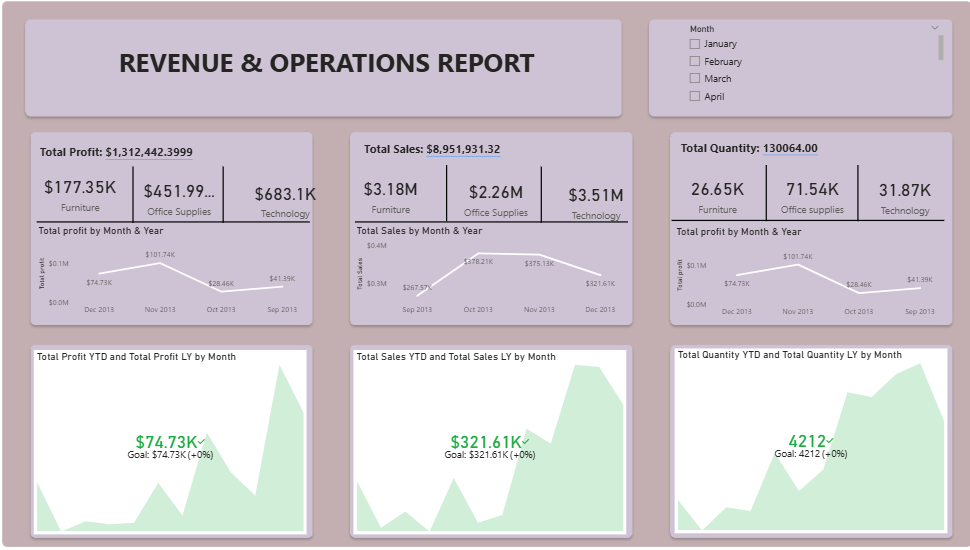
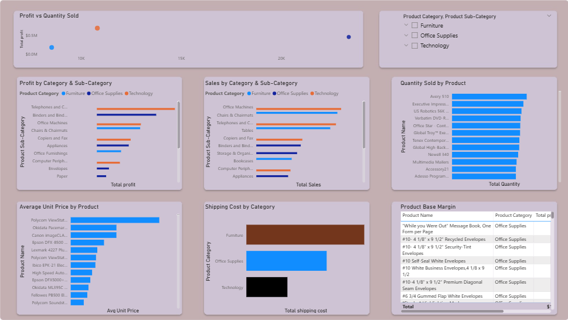
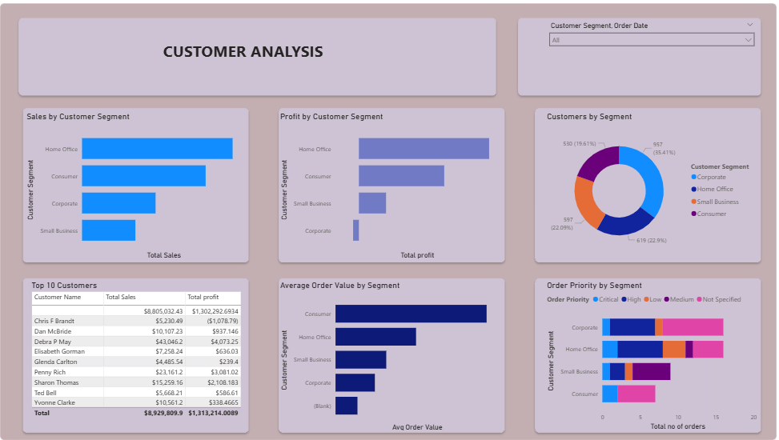
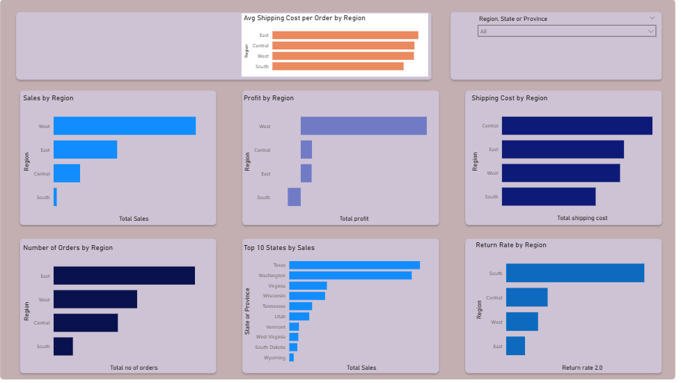
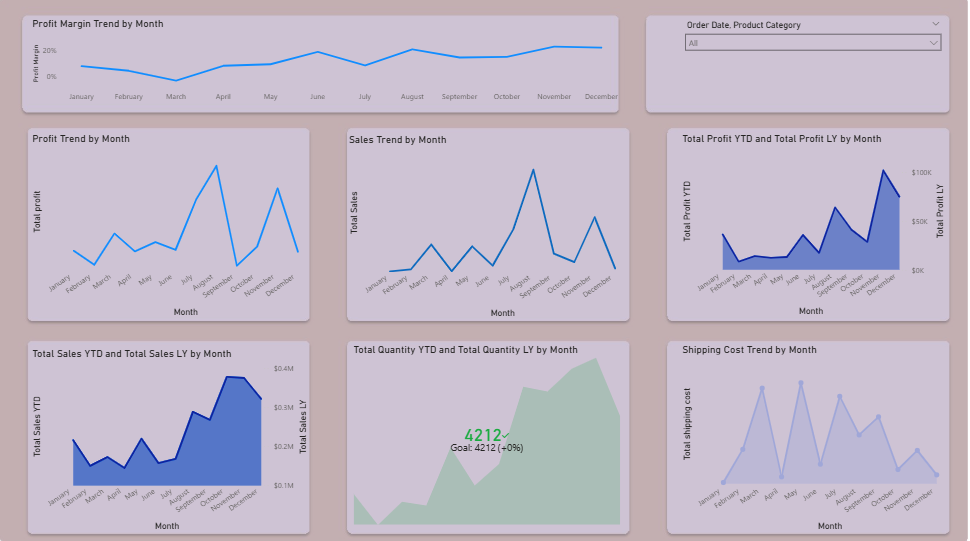

# Power BI — Revenue & Operations Dashboard

**Tools:** Power BI Desktop  
**Dataset:** Superstore Sales Data

### Pages
- Executive Summary — Total profit, sales and quantity by category
- Product Analysis — Profit, sales, unit price and shipping by product
- Customer Analysis — Sales and profit by segment, top 10 customers
- Location Analysis — Sales, profit and shipping cost by region
- Trend Analysis — Monthly profit, sales and quantity trends

### Dashboard Preview

